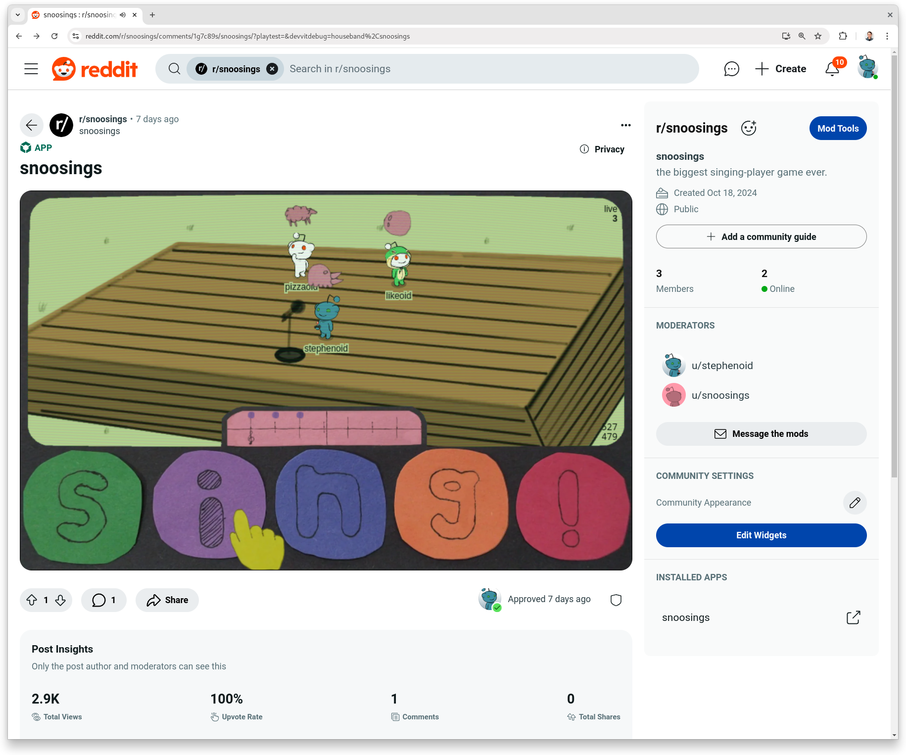

# 🌚 [snoosings](https://reddit.com/r/snoosings)


started by verbatim copying snoosings.


just _streaming_ the state is going to be a lot harder than I thought. the original game was going to just be the player and maybe a few monsters and items. the new game naively plunks 32k ents in. these are some of the ideas I considered and where I saw my last 12 working hours going to be hard:

- only send the current viewport. this would give you kind of a TV-like stream but since realtime is slow and size restricted, we can't send frame by frame. we have to extrapolate. this would likely cause missed bullets to hit and vice versa as the player lerped around. I don't think it would be compelling with the current realtime responiveness. additionally, if the viewer can play and not just view, you have to figure out which enemies target which player and who is the authority on the current state of where enemies are.
- send an initial state 30 seconds ago plus a buffer of all controller inputs received. this sounds ok-ish but I think there's a lot of opportunity to get out of sync. I have to run the simulation at the viewer's framerate and the timing is not going to match. I'll also have to blow away the world every time I get a new message to reset that sync. if I was writing streamable MSPaint, I could report each tool picked and the exact stream of cursor movements. the timing wouldn't matter much because nothing on the canvas is moving.
- send the entire world every message and reset the simulation on every receive. I think this would require a lot of data, a lot of visibly lerping, and a lot of processing for each client. I think it'd look really glitchy.
- send an initial state 30 seconds ago plus a buffer of all state changes using a command pattern with absolute coordinates. I'm not quite sure what the lerping story is and this would require a rearchitecture to operate on commands.

so these sorts of games seem hard to do in realtime
- any game with client contention. many reflex games might fall into this category. if you reimplemented Diablo II, you'd probably want to clone loot to both players if there was contention for picking it up since loss is frustrating and we don't have a server authority.
- any game where you have to reconstruct state and timing matters.

games that might work:
- any game where each client is the authority on their avatar and the world is static or the timing doesn't matter.
- player vs enemy games where the monsters don't move a lot and there's not many of them as at any one time. for example, in Diablo II a barbarian has to walk up to a monster and slash them usually multiple times. if multiple players are fighting side-by-side, the only contention is for loot.

if I want to more seriously pursue this, I need to build the game around that concept. I was just trying to build a single-player game and it was hard to pivot. I think I will need at least: approach, seedable random number generator.

I think there are probably a great big bag of tricks you can use to work around these issues but I don't have the time to realize them and some would probably require a major rearchitecture.

realtime was kind of [snoosings]() thing. the game was built around being able to multiplay. it was disappointing to realize that I had built a game that couldn't duplicate the entire approach.


i run both `npm start` and `npm run playtest` in parallel so I get instant feedback on local only issues and more integrationy issues come.


there's a lot of stuff you can do with these mechanics! these graphics! there's so much I want to explore from more diablo-like games to more vampire survivorish!


- it occurred to me for the first time that I might use type-stripping for unit tests and skip a dependency. use type stripping for unit tests.

```
    "test:unit": "NODE_OPTIONS='--experimental-strip-types --no-warnings=ExperimentalWarning' node src/**/*.test.*",
```

```
import assert from 'node:assert/strict'
import {describe, test} from 'node:test'
import {angleBetween, dotProduct, magnitude} from './2d.ts'

describe('dotProduct()', () => {
  test('v · v', () => {
    assert.equal(
      dotProduct(
        {x: -0.6836781075757513, y: 0.7297836975581459},
        {x: -0.6836781075757514, y: 0.7297836975581458}
      ),
      1
    )
  })
})
```

sadly, requires .ts imports all the way up. esbuild handles this fine for prod code but TypeScript itself doesn't support it.

```
src/shared/tsconfig.json:4:3 - error TS5096: Option 'allowImportingTsExtensions' can only be used when either 'noEmit' or 'emitDeclarationOnly' is set.
```


createPattern doesn't support spritesheets. I guess I should have revisited with non-tiling sprites using the spritesheet.


WH now exported. thought about constructor function but then you have two ways to make them and the native way is only a few characters more.

got off to a real slow start on monday having trouble landing on an idea. I was originally thinking a flappy bird clone but partner told me I could do better.

ended up doing esbuild server style. it was really nice to test without the playtest + shreddit load overhead. an improvement would have been to make a post-like shell but to test a few form factors but we're going to be adding fullscreen support soon and I don't know if web views will even run in post form factors in the future.

copying and pasting let me up where I left off. works great as long as I never need to look back (which should be hte case unless an app becomes popular which is a good problem to have).


I'm really surprised at how far I've been able to get with plain canvas and clipping. 10 000 mobs evenly distributed, full screen of tiles (without a pattern) and zero lag on my 2018 Android phone. it was a little laggy at 100k but playable as long as you didn't group many thousands on the viewport.


snoosings is a networked drum machine with a twist: if the internet drops, the last sent melodies will loop, but otherwise you have to keep playing the tones you want friends to hear, and the farther away you are from snoos, the quieter they sound. it's the biggest singing-player game ever.

[](media/2024-10-26-snoosings.mov)

## learnings

the team's goal for the next two months is to build a hit game. the goal for snoosings was to learn more about how to do that.

### what I'm going to do differently

this section covers changes I want to make but not all the lessons I want to take into the next game.

- maybe there are a couple ways to think of a next project: 1) how can I make a hit game? 2) what's the smallest part of a hit game I can implement that's still fun? unless it's just a tech demo, both the full version and the kernel need to be fun. both should ask, how can I do less? is there a simpler version of this that would make my life easier?
- when planning, think tactically of the cost of the whole. code, art, and sound are each expensive. what must I draw? do I need physics? don't handwave art.
- plan a beginning modestly, end organically. when making pivots, think about the cost / value and what the new core loop is.
- if it's multiplayer, what's the impact for each player of resolving conflicting client states? how many people are needed for a session to be fun?
- refine the blocks to web view bridge. use a message queue, maybe handshaking. really nail the local runtime loaded experience.
- optimize code for copy-and-paste.
- unsubscribe from realtime socket when backgrounded.

### what would make snoosings fun?

I think people would like jamming together more if snoosings was a lot fuller:

- real music and art.
- significantly better balance of sounds. I'm not sure what this looks like exactly but I think real music and sticking to the Pentatonic scale would help. it was pretty neat having 20+ people play simultaneously but chaotic and it was clear that large band balance exploration was needed. I'm just not sure how the sound is going to scale at 100+ simultaneous players.
- increased granularity. there's no technical limitations on this but as a non-musician, it's hard for me to play faster or comprehend multi-measure songs. I think simple is a good default and advanced becomes enabled after some duration with an option to go back to simple. maybe there's an advanced keyboard too with more notes.
- control over your instrument and more roles like dancing and conducting. this adds more variety and gives less musical players an option to play.
- ability to record a concert and share as a post. this emphasizes the content creation aspect of the tool. since everything's a message, this would just be keeping a history and exposing that data as a new post. a much bigger feature would be to allow editing a session before posting. this was the most feedback received from the team.
- more content.
- light game mechanics like a traveling spotlight that enables solos and bumping into another player to clap.
- Karaoke mode where players sing a song together.
- ability to loop multiple tracks in single-player mode.
- DDR mode where players dance to a beat.
- fullscreen and better native app support. both are on the platform roadmap.
- lots of general polish. I captured some ideas in [to-do.text](to-do.text).

this will take months though.

### build fast

I built snoosings in probably about 110 hours, 3000 iterations, and 1800 lines of TypeScript from Wednesday, October 16th, 2024 to Saturday, October 26th in a Ludum Dare-like blitz.

I was slowed down by:

- I'm familiar with the devvit platform but my platform apps experience is modest. historically, most of my work has been in core platform (especially the runtimes), the APIs, the CLI, reddit.com, and [play](https://developers.reddit.com/play). I haven't had much time to write devvit apps beyond fiddles and snoosings is my first devvit web view app. also, web views and realtime both had some rough edges (web views aren't even released yet).
- art and sound are of great interest to me but I struggled to express myself in even novice quality. I'm glad I did, and will continue to, but I want to think carefully about the cost / benefit ratio from the beginning.
- even the most fundamental music concepts are totally alien to me. it was excruciating for me to comprehend some of the core concepts of snoosings. this cost me a lot of time and lowered the quality. in this sense, the pivot was a terrible direction.
- multiplayer ate up quite a bit of time. it took me a while to figure out things like interpolating the melodies the same as positions correctly.
- no framework for anything. want a button? such a simple concept but ends up costing a bit of code and time.
- no workflow for asset creation. I usually use Aseprite and have assets dump out as a single spritesheet with a single command.

I was sped up by:

- a single, very focused, high-intensity effort. most of my other work at reddit has been jumping across many layers of the stack back and forth repeatedly. the team seems to benefit but it hurts my personal productivity, especially for larger projects. there were a couple days I worked in excess of 15 hours on snoosings.
- targeting the Canvas API instead of WebGL. although I hadn't used it much before, the Canvas API is significantly easier. I didn't have to worry about texture management or any kind of real rendering pattern for sprites.
- avoiding a pixel perfect game. past work like [Super Patience](https://superpatience.com) were "hard pixel" games where each pixel was massive and perfect. I have more experience with it now but nevertheless, it's time consuming to avoid literally "one pixel off" issues. you can really see this on mobile where I just let the canvas be grossly squished not even keeping proportions. there's no resize logic (and I know it looks bad). not only is it way easier to just use the native resolution and avoid a pixelated look, I suspect it appeals to a lot more people. I also usually dislike pastiche but here I've embraced it.
- using the snoo sprites instead of drawing unique characters. the little X flipping was enough.
- demo quality everything. even demo quality code, sound, and art together are very expensive. I focused on finishing and I considered whether each improvement would come at the cost of that.
- avoiding a big, vague, special game.
  - when I start any game project, I have absolutely grand visions that I habitually lie to myself. I want it to be something really meaningful, deeply personal, and special. the reality is that either I am quite limited or there's just nothing else that eats up time like building a game. I had to keep a certain detachment and never let any dream become a blocker to finishing. snoosings isn't special--it has especially sloppy art and bad sounds--but it is done. For a quality game, I think allowing more of a focus on making it special would be needed but that wasn't really within scope here.
  - because snoosings isn't special, there were no fixed goals or dreams I couldn't break. development was extremely organic. for example, snoosings started as "redditvszombies" but due to the slowness of realtime, pivoted to a singing game with the idea that if you sang near someone, they'd be converted (like getting bit by a zombie). the zombie idea only took a minute to conceive so little was lost. I think it worked really well.
- avoiding storytelling. I want to make and play games that have fulfilling stories. those are hard to make and it's unclear to me how important that is for a social game.
- awesome typing. once I had a strong foundation in place, the game generally worked as expected from the code. this really helped keep my motivation and productivity high.
- not extracting a game engine. not maintaining a generic game engine or library really freed from having to overworry about the tech.
- keeping as much code as possible in the iframe. I didn't have to think about devvit-isms there and it kept state in one place as much as possible.
- LLMs were a useful alternative to knowing anything about music. I used an LLM to help with the frequency calculations for the Pentatonic scale and logarithmic sound falloff (which is my recollection for how humans hear). it may be totally incorrect. I'm not sure!
- refactoring sprawling complexity. when you're exhausted and the code works but isn't readable, consider a refactor. for example, working hard to get messages typed well made literally every message compiler verified once I had it up and made realtime much simpler to reason about. on the other hand, each ent's rendering code is very messy and tough to make sense of but stayed relatively contained so I left it. I think if I see a lot of potential work in or nearby and low readability, I have it on my mind to refactor. I feel I struck the right ebb and flow balance on that to complete this project.
- writing unit tests for critical uncertain code when it was faster than debugging. I don't have many unit tests for this project but the few I do were because they were valuable.
- the web API gives you so much--UI, networking, sound, graphics-- and all the JavaScript ecosystem of TS, formatter, dependency management, unit testing. there's definitely a lot of regrettable complexity but if you consider the whole out of the box package it takes a lot to beat.
- delete whatever code I didn't need. so simple, so hard. letting go is almost always for the best.
- leveraging a lot of previous learnings from void.

### project scaffolding

there's a lot of boilerplate but it worked well for development.

#### source folders

the source is split into four parts:

- app: conventional devvit blocks code.
- shared: app and web-view compatible code.
- web-view: iframe code.
- test: unit tests (theoretical).

I didn't get to experiment with server-only code.

#### TypeScript config

the TypeScript config is complex. there's a distinct tsconfig for each environment such as tests and web view. they extend a large config under tools/. there's so much boilerplate that it's hard not to feel like overkill but I think it was mostly appropriate (I probably could have dropped the tools config). I think a Deno config would be much slimmer and fewer dependencies. I attempted a Deno project in the first commit but saw some flakiness with devvit playtest. maybe in a few releases.

#### web view TypeScript esbuild compilation

esbuild was used to watch for web-view/ TypeScript changes and outputs a single JavaScript bundle to webroot/. it seemed to work very well. esbuild outputs can likely trigger redundant builds for some changes (eg, shared/) but in practice I didn't notice any issues with it.

#### Biome linter and formatter

Biome worked ok as a linter and formatter. I'm put out by the ESLint-like length of the config I ended up with and it's still missing the most important lint of all, floating promise detection, but I knew that and it's on the roadmap. it's nice that it's both ESLint-ish and Prettier-ish. I look forward to Markdown support as I write this.

### web view and messaging

I tried to keep as much code in the iframe as possible to avoid having to think about devvit-isms. the challenges were:

- identifying when the local runtime was loading and realizing messages may be missed.
- not understanding that a message queue was needed until very late in the project.
- understanding circuit breaks that cause app code to execute on the server but that state arrives eventually client state. (however, the state can be overwritten without a queue.)
- understanding that app renders re-send the state (messages). a simple incrementing ID is used to dedup them.
- understanding how to type all the messages.

I took care up front to try and make the IPC as tight and well-typed as possible so that I would rarely ever suspect a bug here which would undermine all other assumptions. the first version used declaration merging but postMessage() wanted a functional wrapper anyway so I moved the typing there for simplicity. what I implemented worked well but the next game will want a message queue for passing state instead of a single message. I'm uncertain if it needs handshaking when sending from the webview but I think it does.

peer-to-peer realtime messages are layered over the app-to-iframe messaging. not much was needed and it worked great. the typing in @devvit/public-api@0.11.0 stopped every bug at type-check bug.

the game is very message-driven. it might be neat to explore even changing local player updates to use a kind of fake (fast) message just to keep everything going through the same flow.

### realtime messaging

each client is responsible for getting all the details about its player and publishing that in every message so that other instances don't have to flood the server with redundant requests. for example, only one set of calls to the Reddit API per user for things like snoovatar image URL and username. I think it would scale well.

since clients linger for days, a simple versioning protocol is used to filter out messages the game receives from newer and older versions. it made breaking changes to the schema a breeze and the game even informs users if they're on an outdated version.

no attempt was made to eliminate malicious messages but one thing I like about the client reconciliation strategy is that a player can only talk about themselves. there is a hole, however, where a user could tell everyone their app was outdated and to reload. if I cared, I think I would just store a magic number in Redis that apps would compare to server-side when they received a reload request.

the current state of devvit realtime is slow and inconsistent. reflex games and games where resolution contention is confounding probably won't be fun. my experience was massively improved when I started lerping instead of hopping.

if you send frequent messages, realtime will refuse all messages. snoosings tries hard to limit messages sent:

- nearly all messages sent are wrapped in throttle logic.
- idle players attempt to send hearbeat updates every nine seconds.
- when backgrounded, the player stops sending any messages.
- except for the hearbeat frequency, players attempt to only report significant events such as large changes in position, direction, and new tones. for example, if a player is moving consistently in one direction, an initial event is sent to start that movement but only stops and turns are reported along the way.
- all messages contain full player state and nothing else. I thought there was going to be more messages but everything boiled down to just that one "peer update" message. peers can't tell you about events like disconnect and connect has overlap with heartbeat so everything is kind of that heartbeat. over the course of 30 seconds, a player acquires complete world information.
- if no updates are sent from a player are received for 30 seconds, the peer is considered disconnected.
- messages are pretty tiny. sending large audio files was never considered. there's great room to send a lot more data such as longer melodies.

an improvement would be to unsubscribe() from the socket when backgrounded so the player stops receiving messages. I just didn't get around to it.

at the end of the project, I added the ability to send fake peer messages locally which would have been useful for testing larger multiplayer sessions.

### source

I think most of the code is pretty pragmatic and use-case focused. I did a good job staying focused on the goal and not getting hung up on anything. the only slipup I'm aware of was a rather involved circular buffer implementation for the melody that I ended up tossing for a far simpler double buffer after maybe three hours. I'm glad I attempted the Deno version.

#### typing UTC, Tone, Melody, and UUID

I originally used strings and numbers for all of these to avoid overtyping but when the game shifted from `timeOrigin` relative timestamps to UTC, the typing really made it painless to think about. similarly for Tone and Melody. I threw UUID in there because I was surprised to find it was actually more strongly typed in Crypto, just not exposed.

I was pleasantly surprised that the branded types are JSONObject compatible.

I normally write a small constructor for branded types but left almost everything as type-only this time around. eg:

```ts
export function Melody(melody: string): Melody() {
  return melody as Melody
}
```

casting is a little more verbose, harder to refactor from a branded type to an object, and harder to identify references but there's no possible functional overhead. I wonder if the compiler would inline it.

I made a skeletal version of the needed Thing ID types like T2.

#### void

this project draw a lot of inspiration from my engine [void](https://github.com/oidoid/void). it's just over 2000 lines and packs a lot of useful utils with lessons learned. however, void intentionally made too many assumptions around WebGL pixel games that live in a single HTML file. trying to optimize for isolated copying and pasting (ask for what you need and avoid dependencies), minimizing assumptions, and minimizing framework design may have allowed using the project directly comfortably.

#### ents

I didn't spend much time thinking about how to model objects in the world. Player, Peer, P1, metronome, and panel are the big ones. they all have pretty custom rendering logic that I didn't worry about making some generic pattern for.

#### version

I wanted to import the devvit.yaml version to print on launch. since YAML is a superset of JSON, I thought I could just change JSON-fy and symlink it with a .json extension but the devvit CLI YAML-fies it. there's a longstanding task to use package.json instead.

#### declarative HTML and CSS vs TypeScript

TypeScript tries to own as much of the DOM setup as possible. putting it in index.html may work better in some cases but my thinking is that this will be easier to copy-and-paste.

#### XY and WH

```ts
export type Box = XY & WH
type WH = {w: number; h: number}
export type XY = {x: number; y: number}
```

I'm unsure if favoring WH for areas is worth it. XY is used everywhere in snoosings so for better and worse you can pass area where points are wanted, for example. conceptually, `.x` instead of `.w` reads worse for areas.

### art

pretty much all of the UI was drawn on construction paper and photographed with my phone. it was time consuming and definitely not the vision I had but it was reasonably consistent. I didn't strive for much beyond squish and stretch on various viewports.

I edited most (all?) of the art in Gimp. I'm glad that Gimp exists but it's not that user friendly. I briefly tried Krita and Rebelle.

I want to think hard about art needs when I'm planning the next game.

### audio

I recorded most of the audio in Audacity. it worked well and didn't cost me much time. I did have some trouble with my low quality microphone. I have no musical skills so I wasn't thinking more than soundboard quality.

I don't have much experience with the web audio API. except for having to do some digging on proper context management, and that decoding is not synchronous, it was painless.

### UI

#### metronome

the metronome may have been the hardest thing to implement. I added it because I have no rhythm and the game was literally unplayable to me otherwise. some of the challenges were:

- getting the timing lined up right.
- identifying what buffering technique was needed.
- realizing that the record buffer header needed to be a half beat ahead of the visual so musicians could play sloppy and still line up to the expected beat.
- how to swap between the visual / back buffer and recording buffer correctly. for a while, I had an issue where I was replacing a melody mid-playback with the latest information. it was obvious to me visually when I was doing this for location instead of lerping but not for melodies.
- finding that UTC timing was wanted for most of the game so that even local devices can jam together.
- understanding that new melody messages had to be lerped in just like positions.
- I had some troubles getting the construction paper version to look as intended. I think I got lost a bit when I stared moving the measure instead of the indicator.

this is some code I really wanted to tighten up with the learnings earned but I ran out of time.

#### "sing!" keyboard

the "sing!" keyboard was originally one button, then a keyboard disguised as a button. I liked the single button for it's simplicity, and because it felt more welcoming, but it was impossible for me to stay and play. the final version is just five generously sized buttons with seamless hitboxes.

#### loading

my ideal loading experience would be to show a TV screen with static that tunes into the game once fully loaded. unfortunately, that caused a flash of unstyled content and nothing I tried worked. the background color of the iframe was respected but there's still a white flash. it seemed like I had to make a new post to test loading preview which was a bad loop that was eating up more time than the feature was worth.

### live-reload

the new live-reload functionality of the CLI racked up over 2900 pageviews on the primary test post. making playtest part of the default `npm start` script was a no-brainer.

## the road ahead

- request to open-source.
- formally launch if we can and gather learnings for devvit realtime, multiplayer, sound, and quirkiness.
- build something new.
