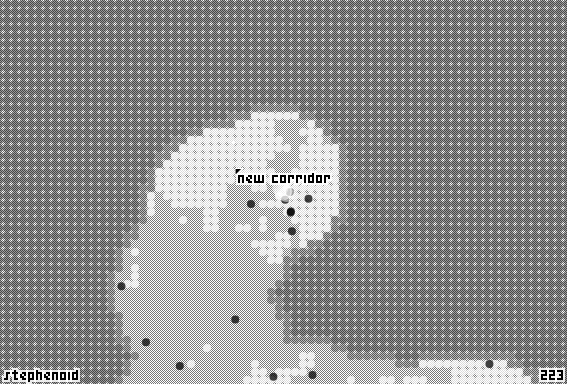

# ⬤◯ [corridor](https://reddit.com/r/corridorgame)

corridor is a top-down shooter.

## project structure

- src/app, src/main.tsx: devvit-specific code. the intent was to keep this part of the code as small as possible to minimize the devvitism learning curve and improve testability.
- src/shared: game code but may also be referenced by devvit.
- src/web-view: iframe and game code.
- src/test: test utils.

## features

- well typed realtime messaging. during play, player score is broadcast over network. the original intent was to livestream all game state but it fell out of scope. includes client version and per post filtering.
- canvas rendering.
- web, native Android app, native iOS app client detection (unused).
- reddit player avatar (snoovatar) querying (unused).
- basic redis state per post.
- well typed devvit to iframe messaging.
- offline esbuild development flow.
- iframe asset loading and initialization flow.
- Reddit Thing ID keying.
- multi-environment TypeScript configuration for worker (devvit), web view (iframe), and test (Node.js).
- web audio.
- pointer, keyboard, and gamepad input.
